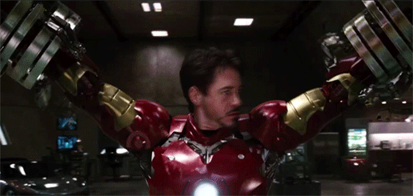

#

  <table>
    <tr>
      <td valign="top">
        
      </td>
      <td valign="top">
        
      </td>
    </tr>
  </table>

#
### About me

MSc Student in Mechanical Engineering (Dynamics & Mechatronics) at EESC-USP. Control & Automation Engineer focused on Mobile Robotics, Multi-Sensor Fusion SLAM, and Autonomous Systems.

#
<h3 align="left">My Stack:</h3>

  
  
  
  
  
  
  
  
  
  
  
  
  
  
  
  
  

#
<h3 align="left">Contact:</h3>

  
   
   
  
  
  

#
### Statistics

|  |  |  |
| :-: | :-: | :-: |

|  |  |
| :-: | :-: |

#

 

<picture>
  <source media="(prefers-color-scheme: dark)" srcset="https://raw.githubusercontent.com/FelipePF22/FelipePF22/output/pacman-contribution-graph-dark.svg">
  <source media="(prefers-color-scheme: light)" srcset="https://raw.githubusercontent.com/FelipePF22/FelipePF22/output/pacman-contribution-graph.svg">
  
</picture>

#

  

  <i>"Always Learning"</i>  

